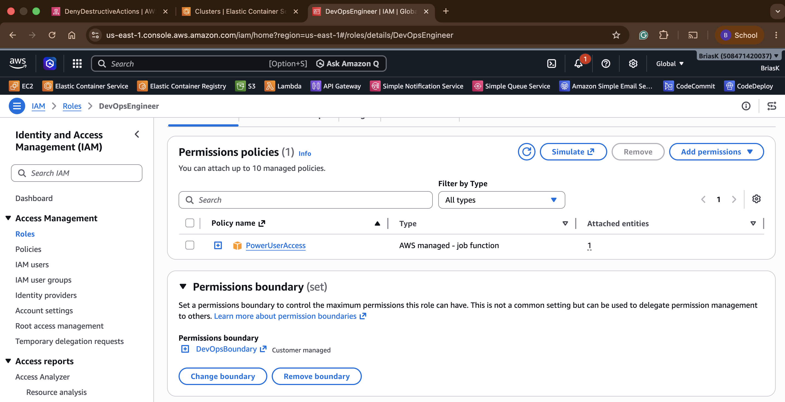
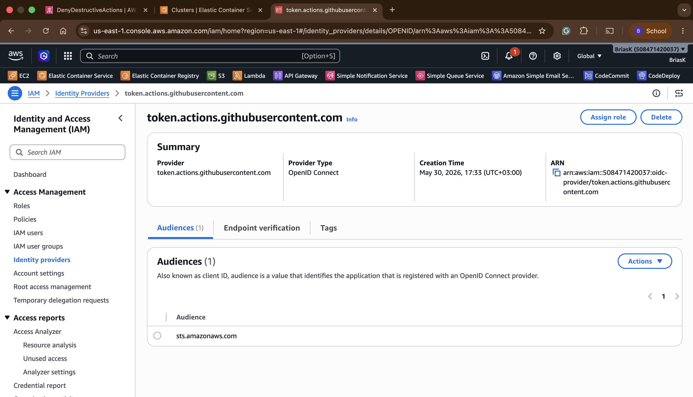
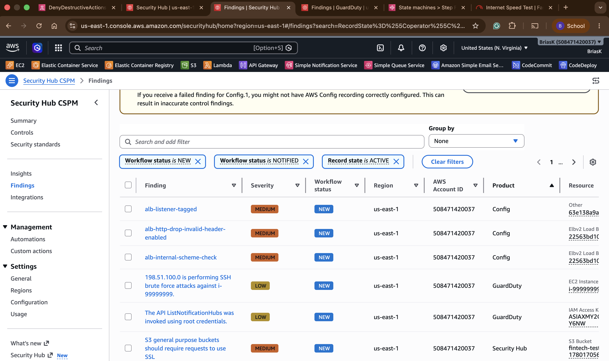
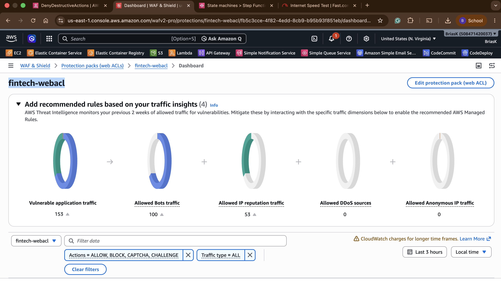
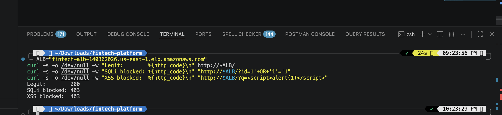
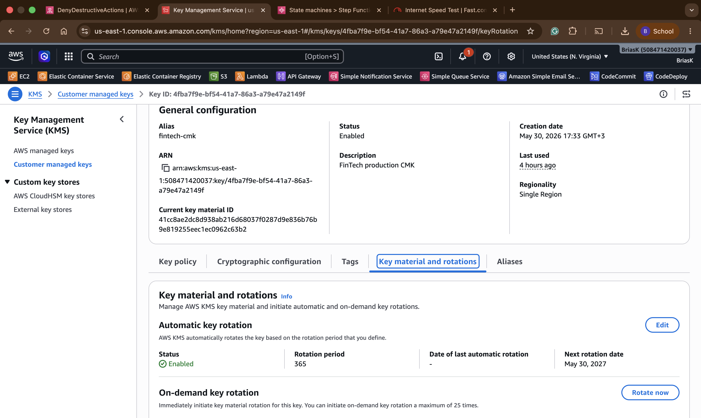

# FinTech AWS Security Platform — Capstone Project

> **Lead DevOps Engineer** | Nairobi-based Fintech | Central Bank of Kenya regulated  
> Multi-account, Zero-Trust, Fully Automated Security Platform on AWS

---

## Architecture Overview

```
AWS Organizations
├── Security OU
├── Production OU  ← SCP: DenyEC2Terminate + DenyCloudTrailStop
└── Development OU ← OIDC CI/CD (GitHub Actions, no static keys)

Incident Response Pipeline:
GuardDuty → EventBridge → Step Functions → Lambda → SNS + S3

Compliance:
AWS Config (auto-remediation) → Security Hub (FSBP) → SNS alerts

Edge Protection:
Internet → WAF (RateLimit + CommonRuleSet + SQLiRuleSet) → ALB → ECS Fargate

Encryption:
KMS CMK (auto-rotation) → S3 (aws:kms) → Secrets Manager
```

---

## Project Requirements Delivered

| # | Requirement | Status |
|---|-------------|--------|
| 1 | Multi-Account Organizations + SCPs | ✅ |
| 2 | IAM Permission Boundary + OIDC Federation | ✅ |
| 3 | GuardDuty + Step Functions Incident Response | ✅ |
| 4 | AWS Config Auto-Remediation + Security Hub | ✅ |
| 5 | ECS App + ALB + WAF (SQLi/XSS/Rate blocking) | ✅ |
| 6 | KMS CMK + S3 Encryption + Secrets Manager | ✅ |
| 7 | Attack Simulation (all 4 scenarios) | ✅ |
| 8 | Architecture Diagram + Executive Report | ✅ |

---

## Repository Structure

```
fintech-platform-capstone/
├── terraform/
│   ├── main.tf              # All infrastructure — one apply deploys everything
│   └── lambda_ir.py         # Incident response Lambda function
├── .github/
│   └── workflows/
│       └── deploy.yml       # GitHub Actions OIDC deployment workflow
├── screenshots/             # Evidence screenshots for each requirement
└── README.md
```

---

## Requirement 1 — Multi-Account Organizations + SCPs

AWS Organizations enabled with All Features. Three OUs under Root: Security, Production, Development. SCP attached to Production OU denying `ec2:TerminateInstances` and `cloudtrail:StopLogging` regardless of local IAM permissions.

### SCP JSON

```json
{
  "Version": "2012-10-17",
  "Statement": [
    {
      "Sid": "DenyEC2Terminate",
      "Effect": "Deny",
      "Action": ["ec2:TerminateInstances"],
      "Resource": "*"
    },
    {
      "Sid": "DenyCloudTrailStop",
      "Effect": "Deny",
      "Action": ["cloudtrail:StopLogging", "cloudtrail:DeleteTrail"],
      "Resource": "*"
    }
  ]
}
```

Organization-wide CloudTrail (`fintech-trail`) enabled across all regions, delivering logs to `s3://fintech-cloudtrail-508471420037` with log file validation enabled.

---

## Requirement 2 — IAM Permission Boundary + OIDC

### Permission Boundary — DevOpsBoundary

Attached to the `DevOpsEngineer` role. Hard ceiling on permissions — `s3:DeleteBucket`, `s3:DeleteObject`, `s3:PutBucketPolicy` all denied even if role policy allows them.



### OIDC Federation — GitHub Actions

No static AWS keys stored anywhere. GitHub Actions exchanges a signed JWT for temporary STS credentials via `AssumeRoleWithWebIdentity`.



### Trust Policy Condition

```json
"Condition": {
  "StringEquals": {
    "token.actions.githubusercontent.com:aud": "sts.amazonaws.com"
  },
  "StringLike": {
    "token.actions.githubusercontent.com:sub":
      "repo:briasbk/fintech-platform-capstone:ref:refs/heads/main"
  }
}
```

Only this exact repo and branch can assume the deploy role. Fork attempts return `Not authorized to perform: sts:AssumeRoleWithWebIdentity`.

---

## Requirement 3 — Automated Incident Response

**Pipeline:** GuardDuty → EventBridge → Step Functions → Lambda → SNS + S3

### Step Functions State Machine Flow

```
ValidateFinding → IsolateInstance → NotifyTeam → Success
      ↓                 ↓
 NotifyFailure     NotifyFailure
```

1. GuardDuty detects severity >= 7 (HIGH/CRITICAL)
2. EventBridge rule triggers Step Functions state machine
3. Lambda validates finding, extracts instance ID
4. Lambda replaces EC2 security groups with `quarantine-sg` (deny all traffic)
5. Instance tagged: `Status=QUARANTINED`, `IncidentId=<finding-id>`
6. Finding JSON logged to S3 under `findings/YYYY/MM/DD/`
7. SNS publishes alert to security team

### SNS Alert Email — End-to-End Proof


---

## Requirement 4 — Continuous Compliance + Security Hub

### Security Hub + Config Findings



### Auto-Remediation Flow

| Step | Action |
|------|--------|
| 1 | Unencrypted S3 bucket created |
| 2 | Config evaluates → `NON_COMPLIANT` |
| 3 | SSM Automation `AWS-EnableS3BucketEncryption` fires automatically |
| 4 | Encryption applied (AES256) |
| 5 | Config re-evaluates → `COMPLIANT` |

Zero human intervention. Full audit trail in CloudTrail.

Security Hub enabled with **AWS Foundational Security Best Practices (FSBP)**. GuardDuty and Config integrated as finding sources. HIGH/CRITICAL findings route to SNS via EventBridge.

---

## Requirement 5 — Application Security (WAF + ALB + ECS)

### WAF Web ACL Rules



| Priority | Rule | Action |
|----------|------|--------|
| 1 | RateLimit (100 req/5min/IP) | Block |
| 2 | AWSManagedRulesCommonRuleSet | Block (OWASP Top 10) |
| 3 | AWSManagedRulesSQLiRuleSet | Block |

### Attack Simulation Results



| Test | Result |
|------|--------|
| Legitimate request | `200 OK` |
| SQL Injection `?id=1' OR '1'='1` | `403 Forbidden` |
| XSS `?q=<script>alert(1)</script>` | `403 Forbidden` |
| Rate limit exceeded | `403 Forbidden` |

WAF logs → CloudWatch `/aws/waf/fintech-webacl` (90-day retention).

---

## Requirement 6 — Full-Stack Encryption

### KMS CMK — Automatic Key Rotation Enabled



| Resource | Encryption |
|----------|-----------|
| S3 `fintech-appdata-*` | `aws:kms` — `alias/fintech-cmk` |
| S3 findings archive | AES-256 |
| Secrets Manager `fintech/prod/db-password` | KMS CMK |

### S3 Encryption Verification

```bash
aws s3api head-object --bucket fintech-appdata-508471420037 --key test.txt \
  --query '{Encryption:ServerSideEncryption,KMSKey:SSEKMSKeyId}'
# {"Encryption": "aws:kms", "KMSKey": "arn:aws:kms:us-east-1:508471420037:key/4fba7f9e-..."}
```

---

## Requirement 7 — Attack Simulation Summary

| Scenario | Action | Automation Triggered | Result |
|----------|--------|---------------------|--------|
| Misconfigured S3 | Created unencrypted bucket | Config + SSM Automation | Encryption applied automatically |
| Malicious network | GuardDuty sample finding | EventBridge → Step Functions → Lambda | EC2 isolated, SNS alert sent |
| CI/CD abuse | Workflow from forked repo | OIDC trust policy | AssumeRole denied |
| App attack | SQLi + XSS + rate limit via curl | WAF rules | All returned 403 Forbidden |

---

## How to Deploy

```bash
cd terraform
terraform init
terraform apply   # fill terraform.tfvars first
```

Confirm SNS email subscription immediately after apply.

---

## Services Used

| Layer | AWS Services |
|-------|-------------|
| Governance | AWS Organizations, SCPs, CloudTrail |
| Identity | IAM, OIDC, Permission Boundaries, STS |
| Detection | GuardDuty, EventBridge |
| Orchestration | Step Functions, Lambda (Python 3.12) |
| Compliance | AWS Config, Security Hub (FSBP), SSM Automation |
| Edge Protection | WAF v2, ALB, ECS Fargate |
| Encryption | KMS CMK, S3 SSE-KMS, Secrets Manager |
| Alerting | SNS, CloudWatch Logs |
